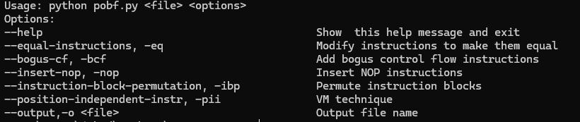

# Zone a metamorphic code obfuscator
Zone is a metamorphic payload obfuscator aimed at bypassing signature detection at both scantime and runtime

## Paylaod obfuscation

Right now it supports mainly small sized payloads, especially it has been tested on both x64 and x86 Windows payloads generated with msfvenom from metasploit.

## Platform

Zone has 2 modules: one for x64 payloads (**pobf.py**) and one for x86 payloads (**pobg86.py**). It has been tested ONLY FOR WINDOWS, but can be extended to support linux payloads. maybe it already works but maybe it contains some particolar instructions that need to be handled specifically.

## Installation
1) Clone this repo
2) `pip install requirements.txt`

## Usage

In order to mutate an x64 payload we need to run: `python3 pobf.py <payload_file> <techniques>`

In order to mutate an x86 payload we need to run: `python3 pobf86.py <payload_file> <techniques>`

The mutated payload will be stored in the created file: `new_payload.bin`

## Running and testing payloads

To test an x64 payload (Execute it) run: `ploader.exe new_payload.bin`
To test an x86 payload (Execute it) run: `ploader86.exe new_payload.bin`
